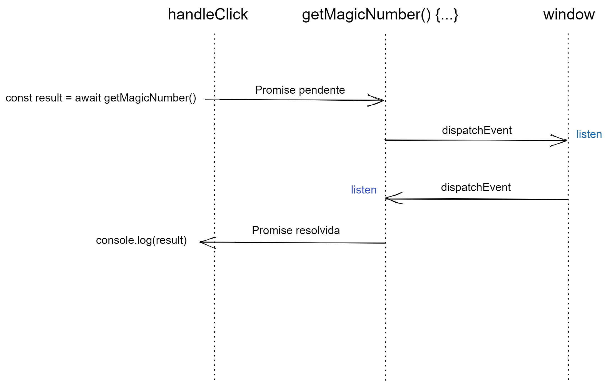

# CustomEvent + Promise + Async await

Conteúdo totalmente vanilla JavaScript onde mostro uma integração de async await, promises e com custom event.

A ideia é utilizar async await para esperar uma resposta de evento.

## Vídeoaula
Você pode assistir a aula em vídeo no meu [canal YouTube acessando aqui](https://youtube.com/@ProgramadorABordo).

## Eventos

O JavaScript no navegador segue um modelo orientado a eventos. Temos evento de quando a página carrega, quando clica em um botão, quando um formulário é enviado, quando você sai da página, etc.

Vamos começar passo a passo criando um evento comum no JavaScript web, que é de um clique no botão que vamos utilizar posteriormente

```html
<body>
  <button type="button" id="btn">Clique</button>
  <script>
    const button = document.querySelector('#btn');
    button.addEventListener('click', handleClick);

    function handleClick(event) {
      console.log('Olá');
    }
  </script>
</body>
```

## Evento customizado

Vamos criar nosso primeiro evento customizável. Ou seja, evento que não é nativo do ambiente que estamos, que no caso é o navegador.

Um tipo de evento que só nossa aplicação e quem está conectada com ela podem conhecer

Vamos disparar um evento customizável dentro da nossa função handleClick

### Dispatch Event

[Como podem ver na documentação](https://developer.mozilla.org/en-US/docs/Web/API/EventTarget/dispatchEvent), dispatchEvent é emitido por um EventTarget.. Um [EventTarget](https://developer.mozilla.org/en-US/docs/Web/API/EventTarget) é o Window, document ou element. Vamos começar pelo window

```js
function handleClick(event) {
  window.dispatchEvent()
}
```

O que precisamos passar para `dispatchEvent` é uma interface [Event](https://developer.mozilla.org/en-US/docs/Web/API/Event) ou suas derivações


Por exemplo, se dermos um `console.log` no evento que chega ao `handleClick`

```js
function handleClick(event) {
  console.log(event);
}
```

Você vai ver o [PointerEvent](https://developer.mozilla.org/en-US/docs/Web/API/PointerEvent) na lista de interfaces baseado no `Event`. 

### CustomEvent
Quando queremos criar nosso próprio evento, existe uma interface própria para isso, que é a [CustomEvent](https://developer.mozilla.org/en-US/docs/Web/API/CustomEvent). Você basicamente precisa apenas instanciar ela, passar o nome do evento e um objeto com a propriedade `detail` que vai carregar os dados que precisa passar

```js
function handleClick(event) {
 window.dispatchEvent(
   new CustomEvent('clicoou', {
     detail: {
       randomNumber: Math.floor(Math.random() * 1_000)
     }
   })
 )
}
```

Legal! Disparamos nosso primeiro evento customizado! E agora?

Agora precisamos ouvir esse evento.

### Ouvindo evento customizado

Veja que disparamos o evento no nível `window`, então só quem vai ser capaz de capturar é o `window`.

Para ouvir o evento customizado, é exatamente como fazemos com qualquer ouvinte de evento que existe no navegador, como o `click`

```js
window.addEventListener('clicoou', function(event) {
  console.log(event.detail?.numeroAleatorio);
}) 
```

Veja que no console, imprime o tipo como `CustomEvent`

### Bubbles

Se eu quiser dar `dispatchEvent` a partir de um `EventTarget` e querer que seja capturado por outro `EventTarget` ancestral, precisamos passar a propriedade `bubbles` como `true`

```js
function handleClick(event) {
 event.target.dispatchEvent(
   new CustomEvent('clicoou', {
     bubbles: true,
     detail: {
       numeroAleatorio: Math.floor(Math.random() * 1_000)
     }
   })
 )
}
```

## Async await

Agora que já entendemos sobre eventos customizados, vamos criar uma função assincrona onde vamos utilizar o `await` para esperar uma comunicação entre eventos

A proposta é a seguinte



Como vimos no desenho, nossa função `getMagicNumber` retorna uma `Promise`, pois é através da API de promise que conseguimos transformar resoluções de callback para Promise, para utilizar async await.

```jsx
function getMagicNumber() {
  return new Promise(resolve => {

  })
}

async function handleClick(event) {
  const magicNumber = await getMagicNumber();
  console.log(magicNumber);
}
```

Vamos fazer a emissão do evento dentro da Promise

```js
function getMagicNumber() {
  return new Promise(resolve => {
    window.dispatchEvent(
      new CustomEvent('comunica', {
       bubbles: true,
       detail: {
         randomNumber: Math.floor(Math.random() * 1_000)
       }
     })
   )
  })
}
```

Agora precisamos ouvir o evento `comunica` para ouvir esse evento, receber a informação e mandar novamente um evento para `getMagicNumber` ou quem quiser ouvir

```jsx
window.addEventListener('comunica', function(event) {
  const randomNumber = event.detail.randomNumber * 2;
  window.dispatchEvent(
    new CustomEvent('comunicado', {
      detail: {
        message: `Número aleatório é ${randomNumber}`
      }
    })
  );
});
```

Agora basta nossa função `getMagicNumber` receber esse evento e resolver a promise.

```jsx
function getMagicNumber() {
  return new Promise(resolve => {
    window.addEventListener('comunicado', (event) => {
      resolve(event.detail);
    });

    event.target.dispatchEvent(
      new CustomEvent('comunica', {
       bubbles: true,
       detail: {
         randomNumber: Math.floor(Math.random() * 1_000)
       }
     })
   )
  })
}
```

Tudo acontece muito rápido, vamos por um timer para demorar na resposta e conseguir entender melhor oq está acontecendo

```jsx
window.addEventListener('comunica', function(event) {
  const randomNumber = event.detail.randomNumber * 2;

  setTimeout(() => {
    window.dispatchEvent(
      new CustomEvent('comunicado', {
        detail: {
          message: `Número aleatório é ${randomNumber}`
        }
      })
    );
  }, 1_500);
  
});
```

E agora, podemos desabilitar o botão enquanto não recebemos a resposta, para não acontecer de sair clicando no botão várias vezes

```jsx
 async function handleClick(event) {
  event.target.disabled = true;
  const magicNumber = await getMagicNumber();
  event.target.disabled = false;
  console.log(magicNumber);
}
```

## Removendo evento

O evento comunica precisa estar sempre ativo para responder quem se comunica com ele. Porém, o evento comunicado não precisa ficar ativo. Ele só precisa ser usado uma única vez por cada evento comunica, sem precisar ficar ativo sempre.

Por isso, vamos remover. Para isso, precisamos extrair a arrow function do evento `comunicado` para uma função nomeada que chamei de `handleComunicado` e posteriormente adicionar a linha do `removeEventListener`.

```jsx
function getMagicNumber() {
    return new Promise(resolve => {
      window.addEventListener('comunicado', handleComunicado);

      function handleComunicado(event) {
        window.removeEventListener('comunicado', handleComunicado);
        resolve(event.detail);
      }

      event.target.dispatchEvent(
        new CustomEvent('comunica', {
        bubbles: true,
        detail: {
          randomNumber: Math.floor(Math.random() * 1_000)
        }
      })
    )
    })
  }
```